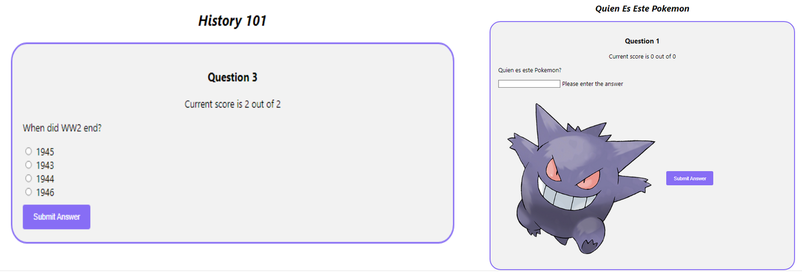
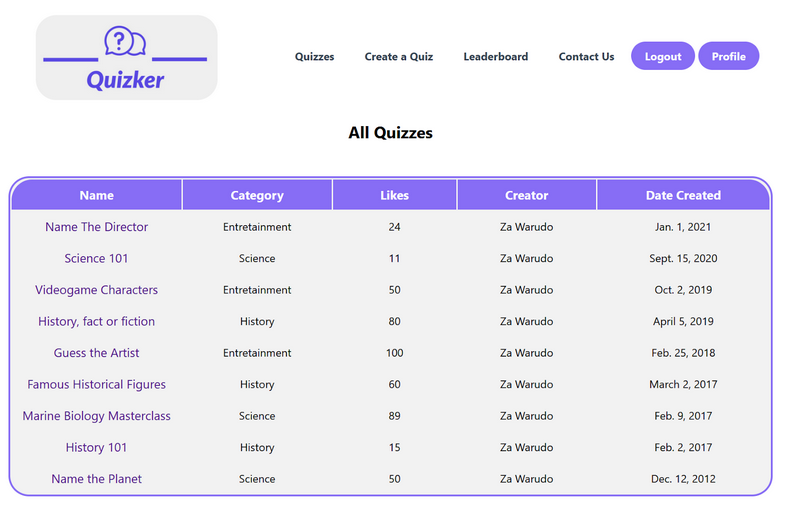
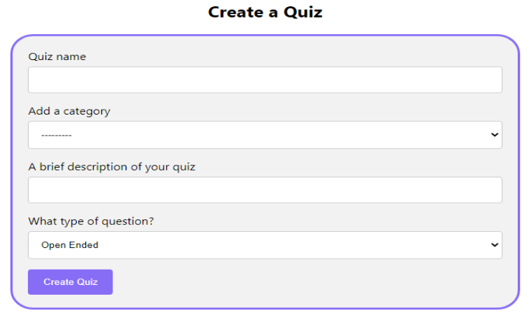

# Quizker

Web application that allows users to create various quizzes with different types of questions in different categories, allows users to participate in other peoples quizzes, like other peoples quizzes and have their average score on all the quizzes they have completed added to the overall leaderboard. In order to create a quiz users will have to create a profile (username and password). A user will only be able to complete each quiz once.

## Play
- Immerse in a myriad of different quizzes
- Three types of Quizzes: True Or False, Open Ended or Multiple Question
- Multiple categories so you can test your knowledge in several different fields

## Create
- Quizker allows the creation of quizzes by its users
- A constantly evolving platform for quizzes, with new quizzes being added constantly
- Login checks ensure only registered users can create quizzes, preventing spam quizzes
- Possible to upload images for more dynamic quizzes

# Compete
- Quizker also provides ways to compete with fellow users
- Points earned through quizzes are tied to the users profile, providing an easy to keep track of performance
- The Leaderboard  allows users to compare themselves against top ranking players, fueling the flames of competition
- To ensure a fair and competitive environment, users can only attempt quizzes one time

